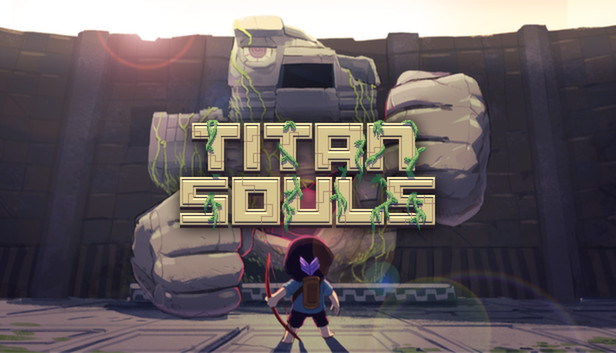
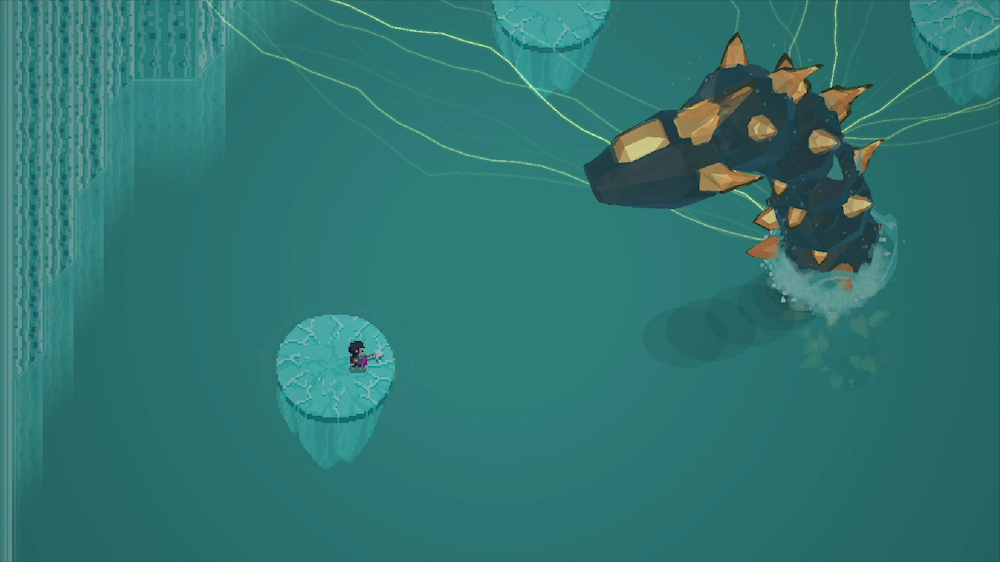

# Titan Souls 1.0.3 — universal ARMv7 Android compatibility port

[](https://github.com/NextOs-Ports/titansouls-nextos/releases)
[](https://github.com/NextOs-Ports/titansouls-nextos/blob/main/LICENSE)
[](https://portmaster.games/)

**Language / Idioma:** [English](#english) · [Português](#português)

This is an independent compatibility port. The repository contains only the
port-specific free adapter, tests, manifests, documentation and packaging
recipes. It deliberately does **not** vendor the shared NextOS framework,
NXExtract runtime, compiled binaries or proprietary Titan Souls data.

[Download the latest PortMaster package / Baixar o pacote PortMaster](https://github.com/NextOs-Ports/titansouls-nextos/releases)



Official Titan Souls media shown for identification. Game and artwork remain
property of Acid Nerve and Devolver Digital and are not included in the port.

## Community

Questions, bug reports, help getting the port running, and news about the next
ports:

💬 **Discord:** [discord.gg/DHfY62eDNN](https://discord.gg/DHfY62eDNN)

## English

### Status

Titan Souls' original Android ARMv7 build is playable through its native
NativeActivity flow. The port keeps the game's own `android_main`, rendering,
FMOD audio, input and save paths while adapting the Android interfaces to Linux
handheld firmware.

The physical evidence is deliberately split by hardware and artifact:

| Physical target | Display / GPU | Validated result |
|---|---|---|
| ArkOS, Mali-G31 | 640×480, KMSDRM | gameplay, video, music/SFX, native controller and persistent save; later hardened build reached the title and returned cleanly |
| NextOS, Mali-450 / Utgard | 1280×720, fbdev/GLES2 | clean NXExtract install, gameplay at about 60 FPS, music/SFX, native controller, save and clean shutdown; a one-pixel tile grid remains a known visual limitation |
| ROCKNIX Nightly, Miyoo Flip / RK3566 | 640×480, Mali-G52/Wayland | gameplay/video/input reached; RC4's adapter-only FMOD correction restored working audio according to the physical tester |
| Other device families | — | unvalidated until the same package and SHA-256 pass physically |

Version 1.0.0-rc.4 is therefore a public pre-release candidate, not evidence
of universal device support. The ROCKNIX audio correction was physically
confirmed through the test package and its executable is byte-identical to the
one in RC4. The exact final ZIP/SHA-256 still needs complete physical
installation and gameplay validation. Passing host gates does not replace that
proof.




### Main problems solved

| Symptom | Root cause | Final solution |
|---|---|---|
| Android game could not start on Linux | NativeActivity, Bionic and JNI interfaces were unavailable | Preserve the stock Android startup order and delegate to the game's real `android_main` through the ARMv7 compatibility adapter |
| Video context failed across different firmware | fbdev, KMSDRM and Wayland expose EGL ownership differently | Keep one negotiated SDL/EGL share root and let the guest create its native child context |
| Music and sound needed Android OpenSL ES | FMOD Ex queues PCM through OpenSL rather than Linux audio APIs | Bridge the exact OpenSL queue contract to SDL audio without changing the game's mixer |
| ROCKNIX had gameplay but no audio | Legacy FMOD understood ARMv7 `vfp/neon`, while the AArch64 kernel reports equivalent `fp/asimd` names | Translate only those proven names for the pinned guest's `/proc/cpuinfo` read; no global framework quirk |
| Android menu exposed only two language choices | Complete language columns shipped in the game but were hidden by the Android toggle | Extend the native Options toggle to English, French, German, Portuguese and Spanish and save through the game's own config path |
| Owner data could be installed partially | Manual APK/OBB extraction was not transactional | NXExtract validates the exact v1.0.3 inputs, stages them and commits only a complete payload |
| Mali-450 shows a one-pixel tile grid | The exact Utgard sampling/coverage cause is not yet proven | Keep the bounded experiment port-local and document the visual limitation instead of applying a global texture workaround |

### Architecture

- `nxloader` strictly loads the two pinned ARMv7 Android modules: FMOD Ex first,
  then the Abstraction Games engine. Relocation, import resolution, ARM/Thumb
  hooks, soft-float call boundaries, final protection and initializers retain
  their native order.
- The audited fixed guest currently asks the dynamic façade only for the exact
  OpenSL ES surface and `__android_log_write` through `RTLD_DEFAULT`. The façade
  still retains a generic host `dlopen`/`dlsym` compatibility fallback, however;
  replacing it with an exact OpenSL magic handle, the explicit log symbol and
  rejection of everything else remains post-RC hardening work.
- `nxandroid` describes the delegated NativeActivity lifecycle without inventing
  Java callbacks or skipping `android_main`.
- `nxcompat` probes the host and accepts the runtime only after the graphics,
  input and audio receipts satisfy the manifest requirements.
- `nxgl` owns the SDL/EGL/GLES2 window and share root. The guest EGL façade
  creates child contexts and keeps the engine's single swap/present path.
- `nxinput` owns the one SDL event pump and translates the firmware controller
  mapping to the Android input queue.
- `nxaudio` validates the FMOD Ex → OpenSL ES → SDL output contract and provides
  a fail-closed backend-retry policy. The adapter preserves an explicit audio
  selection, pins recovery to FMOD Ex 4.44.17, and permits at most one OpenSL or
  compiled-ALSA recovery after a matching real failure. The guest's queued PCM
  remains under the narrow per-game shim.
- FMOD Ex 4.44.17 predates AArch64 `/proc/cpuinfo` feature names. On an AArch64
  kernel it rejected the 32-bit guest with `FMOD_ERR_NEEDSHARDWARE` before
  OpenSL/SDL was entered. The Titan Souls adapter now preserves the native file
  and adds `vfp`/`vfpv3`/`vfpv3d16` and `neon` aliases only when architecture 8+
  and the equivalent `fp`/`asimd` capabilities are actually present. This is a
  version-specific guest compatibility rule, not a global framework default.
- `nxgenerator` 0.2.0 and `nxbootstrap` 0.6.5 produce one foreground PortMaster
  launcher. A second public `run.sh` is forbidden.
- NXExtract 1.2.6 installs owner-provided data transactionally. `nxabi` and
  `nxrelease` audit every packaged ELF and reopen the deterministic ZIP.
  `nxobs` is used only on the host to sanitize a support bundle; neither raw
  logs nor that bundle belongs in the public ZIP.

### Tile-grid diagnosis and attempted mitigation

The historical grid is not present in the artwork. Captured tilemap vertices
have exact adjacent 16×16 geometry and exact 16/1024 atlas spans. The stronger
explanation is precision at the atlas edge: Mali-400/450 fragment arithmetic is
FP16, so an interpolated coordinate in the upper half of a 1024-pixel atlas can
round into the neighbouring tile. A transparent neighbour is discarded and the
clear colour remains visible as a one-pixel line.

An offline FP16 replay of the captured title tilemap predicted 291 samples one
texel beyond their intended horizontal tile. A structural quarter-texel inset
removed all predicted excursions without dropping either edge texel in that
model. The candidate therefore recognizes only the Titan Souls 16×16 tilemap
quad layout, moves each UV endpoint by 0.25/1024 in U and V, and promotes only
the hueshift shader's UV varying from `lowp` to `mediump`. It does not globally
change texture wrapping, filtering, unrelated shaders or geometry.

The physical Mali-450 test still showed the grid with both changes active. The
simulation exposed a real precision hazard, but that hazard is not a sufficient
explanation or the dominant path on this driver. The port carries the narrow
mitigation without claiming a fix, and the grid remains a known visual
limitation. The next discriminating experiments are a discard-colour probe on
Utgard, a geometry-edge/vertex-rounding A/B, and—only if sampling is proven—the
standard half-texel or an extruded-border atlas approach. The clean Mali-G31
result cannot classify the Utgard defect. Relevant precision background is
available from Arm's
[mobile GPU precision benchmark](https://community.arm.com/arm-community-blogs/b/mobile-graphics-and-gaming-blog/posts/benchmarking-floating-point-precision-in-mobile-gpus)
and [Mali-400 texture-coordinate discussion](https://community.arm.com/support-forums/f/mobile-graphics-and-gaming-forum/9384/incorrect-drawing-image-with-wayland-on-mali400).

### Controls

- Left stick and D-pad: native movement axes.
- Face, shoulder and stick buttons: native Android gamepad buttons.
- Start: native game menu.
- Select + Start: orderly exit through the same shutdown request used by
  `SIGTERM`.

The launcher exports the firmware's controller mapping only when it is nonempty.
It does not capture the D-pad for a cursor and does not force SDL video or audio
drivers.

### Language

The Android release originally exposes only System Language and Titan in its
native toggle, although the shipped text contains complete English, French,
German, Portuguese and Spanish columns. The adapter completes that same native
Options menu as System Language, English, Français, Deutsch, Português, Español
and Titan. A selection goes through the game's `Language::ChangeLanguage` and
`ConfigSave::Save`, so it persists without a launcher setting or an external
rewrite of `config.txt`. A clean installation keeps the upstream English
default. Italian text exists in the data but is not exposed because this Android
engine does not recognize an Italian language key safely.

### Owner data and installation

Use a lawfully obtained Android v1.0.3 copy. NXExtract identifies inputs by
content rather than by their filename and accepts the pinned `armeabi-v7a`
engine/FMOD libraries, APK assets and `main.31.com.devolver.titansouls.obb`.
See [INSTALLATION.md](INSTALLATION.md) for the public package layout.

Quick installation:

1. Extract the latest release ZIP into the firmware's `ports` directory.
2. Put a lawful Titan Souls Android v1.0.3 APK and matching
   `main.31.com.devolver.titansouls.obb` in `titansouls/gamedata/`.
3. Launch **Titan Souls**; NXExtract validates and installs the data on the
   first run.

### Build and host gates

The shared NextOS framework is intentionally external to this repository. A
standalone checkout must point the build at an authorized framework checkout;
framework source and generated runtime files must not be committed here.

```bash
# Run from this port directory (the standalone repository root).
# Monorepo checkout only: cd ports/titansouls
export NEXTOS_SDK_ROOT=/path/to/sdk-or-armhf-sysroot
export NEXTOS_FRAMEWORK_ROOT=/path/to/framework
export NXEXTRACT_SOURCE_ROOT=/path/to/canonical-nxextract
./build_universal.sh
python3 -B "$NXEXTRACT_SOURCE_ROOT/nxextract.py" \
  recipe-check --recipe extractor.json
python3 -B "$NEXTOS_FRAMEWORK_ROOT/nxabi/nxabi.py" \
  audit build/titansouls-nextos
python3 -B "$NEXTOS_FRAMEWORK_ROOT/nxrelease/nxrelease.py" validate \
  --manifest nxrelease.json
# Or run all generation/build/ABI/release gates into a new destination:
./package/build-package.sh /path/to/new-release-directory
```

Inside the integration monorepo, the framework and NXExtract roots are found
automatically; `NEXTOS_SDK_ROOT` remains explicit. A standalone source checkout
must set all three roots shown above. The package recipe materializes the
generated launcher and redistributable runtimes outside the tracked source
allowlist.

Periodic bench telemetry is opt-in: `TS_HEARTBEAT=1`, `TS_PERF=1` and
`TS_AUDIO_PERF=1` enable the looper, frame-time and audio reports respectively.
They are all disabled by default in normal gameplay.

The public executable is named `titansouls-nextos`. Its release profile is
ARMHF with a declared minimum glibc of 2.28 and a hard ceiling of 2.30. The
final gate checks every Linux ELF, not only the game loader. Android owner
libraries are validated by NXExtract and are never packaged.

### Source map and licences

- `src/main.c`, `src/ts_loader.c`: native sequence and strict two-module loader.
- `src/lifecycle.c`, `src/framework_bridge.c`: nxandroid lifecycle and nxcompat
  receipts/readiness.
- `src/egl_shim.c`: guest EGL façade over nxgl.
- `src/android_shim.c`: Android looper/input façade over nxinput.
- `src/opensles_shim.c`, `src/audio_recovery_policy.*`: FMOD/OpenSL queue bridge
  and the exact-version, bounded output recovery validated by nxaudio.
- `src/cpuinfo_compat.*`: bounded translation of proven AArch64 feature names
  for the legacy FMOD ARMv7 probe; `tests/test_cpuinfo_compat.c` covers its
  positive, native-ARMv7, capacity and fail-closed cases.
- `src/language_menu.c`, `src/language_menu_policy.*`: version-gated completion
  of the native language menu and mapping to the guest locale enum.
- `tests/test_language_menu_policy.c`, `tests/test_audio_recovery_policy.c`:
  focused host coverage for the seven-choice mapping and bounded recovery.
- `src/imports.c`, `src/tilemap_uv_fix.h`: guest import façade, hueshift UV
  precision promotion and tilemap UV correction.
- `extractor.json`: port-specific BYO-data recipe. The canonical NXExtract 1.2.6
  runtime is materialized only in `.build/` and the public ZIP.
- `port-env.sh`: separates the guest's `LOG.txt` from `log.txt` on
  case-insensitive filesystems.
- `build_universal.sh`, `nxrelease.json`: low-glibc build and public package
  gates.

The NextOS loader and integration are GPL-3.0-only; see `LICENSE`. NXExtract is
MIT-licensed; see `licenses/NXExtract-MIT.txt`. Titan Souls, its Android engine,
FMOD Ex binary, artwork, music and other owner data remain under their respective
rightsholders' terms and are outside these licences. See `NOTICE.md`.

## Português

### Estado

O build Android ARMv7 original de Titan Souls roda pelo fluxo nativo de
NativeActivity. O port conserva o `android_main`, renderização, áudio FMOD,
controle e save do próprio jogo, adaptando somente as interfaces Android para
os firmwares Linux dos portáteis.

A evidência física está separada por hardware e por artefato:

| Alvo físico | Tela / GPU | Resultado validado |
|---|---|---|
| ArkOS, Mali-G31 | 640×480, KMSDRM | gameplay, vídeo, música/efeitos, controle nativo e save persistente; build endurecido posterior chegou ao título e voltou corretamente |
| NextOS, Mali-450 / Utgard | 1280×720, fbdev/GLES2 | instalação limpa pelo NXExtract, gameplay a cerca de 60 FPS, música/efeitos, controle nativo, save e saída limpa; permanece uma grade visual de um pixel |
| ROCKNIX Nightly, Miyoo Flip / RK3566 | 640×480, Mali-G52/Wayland | gameplay/vídeo/controle alcançados; a correção local de FMOD do RC4 restaurou o áudio segundo o testador físico |
| Outras famílias | — | não validadas até o mesmo pacote e SHA-256 passarem fisicamente |

Logo, a versão 1.0.0-rc.4 é uma pré-release pública, não prova de suporte
universal. A correção de áudio no ROCKNIX foi confirmada fisicamente com o
pacote de teste, cujo executável é byte-idêntico ao usado no RC4. O ZIP/SHA-256
final exato ainda requer instalação e validação física completa de gameplay.
Gate de host não substitui essa prova.

### Principais problemas resolvidos

A tabela “Main problems solved” da seção em inglês registra sintomas, causas e
soluções. Em resumo, o port preserva o lifecycle Android nativo, adapta EGL,
OpenSL/SDL e controle, completa os idiomas já presentes no jogo e instala os
dados do usuário de forma transacional. A compatibilidade de CPU que resolveu o
áudio no ROCKNIX fica somente no adapter de Titan Souls; não virou comportamento
global do framework.

### Arquitetura

- `nxloader` carrega estritamente os dois módulos Android ARMv7 pinados: FMOD Ex
  primeiro e depois a engine da Abstraction Games. Relocação, imports, hooks
  ARM/Thumb, fronteiras soft-float, proteção final e inicializadores preservam a
  ordem nativa.
- O guest fixo auditado pede à fachada dinâmica somente a superfície OpenSL ES
  exata e `__android_log_write` via `RTLD_DEFAULT`. A fachada ainda preserva um
  fallback genérico de compatibilidade por `dlopen`/`dlsym`; trocá-lo pelo magic
  handle exato de OpenSL, pelo símbolo explícito de log e rejeição do restante é
  hardening posterior a este RC.
- `nxandroid` descreve o lifecycle delegado de NativeActivity sem inventar
  callbacks Java nem pular o `android_main`.
- `nxcompat` sonda o host e só libera o runtime quando os recibos de vídeo,
  entrada e áudio satisfazem o manifesto.
- `nxgl` é dono da janela e da raiz compartilhada SDL/EGL/GLES2. A fachada EGL
  do guest cria contextos filhos e preserva o único swap/present da engine.
- `nxinput` é dono do único pump de eventos SDL e traduz o mapping do firmware
  para a fila de entrada Android.
- `nxaudio` valida o contrato FMOD Ex → OpenSL ES → SDL e fornece uma política
  fail-closed de retry de backend. O adapter preserva seleção explícita, fixa a
  recuperação no FMOD Ex 4.44.17 e admite no máximo uma recuperação OpenSL ou
  ALSA compilada depois de uma falha real compatível. O PCM enfileirado pelo
  guest permanece no shim estreito deste jogo.
- O FMOD Ex 4.44.17 é anterior aos nomes de features de `/proc/cpuinfo` do
  AArch64. Nesse kernel ele recusava o guest de 32 bits com
  `FMOD_ERR_NEEDSHARDWARE` antes de entrar em OpenSL/SDL. O adapter de Titan
  Souls agora conserva o arquivo nativo e acrescenta os aliases
  `vfp`/`vfpv3`/`vfpv3d16` e `neon` somente quando arquitetura 8+ e as features
  equivalentes `fp`/`asimd` realmente existem. É uma compatibilidade específica
  deste guest/versão, não um default global do framework.
- `nxgenerator` 0.2.0 e `nxbootstrap` 0.6.5 geram um único launcher PortMaster em
  foreground. Um segundo `run.sh` público é proibido.
- NXExtract 1.2.6 instala os dados do dono de forma transacional. `nxabi` e
  `nxrelease` auditam cada ELF empacotado e reabrem o ZIP determinístico.
  `nxobs` serve somente para sanitizar um bundle de suporte no host; nem logs
  brutos nem esse bundle entram no ZIP público.

### Diagnóstico e mitigação tentada para a grade

A grade histórica não faz parte da arte. Os vértices capturados do tilemap têm
geometria adjacente exata de 16×16 e intervalos exatos de 16/1024 no atlas. A
explicação mais forte é a precisão na borda: a aritmética de fragmento do
Mali-400/450 é FP16, então uma coordenada interpolada na metade superior de um
atlas de 1024 pixels pode arredondar para o tile vizinho. Se ele for transparente,
o fragmento é descartado e a cor de limpeza aparece como linha de um pixel.

Uma reprodução offline em FP16 do tilemap capturado no título previu 291 amostras
um texel além do tile horizontal correto. Um recuo estrutural de um quarto de texel
eliminou todas as excursões previstas sem perder os texels das bordas no modelo.
A implementação é estreita: reconhece o layout de quads 16×16 de Titan Souls e
move somente as extremidades UV em 0,25/1024 em U e V. Ela também promove apenas
o varying UV do shader hueshift de `lowp` para `mediump`. Não muda globalmente
wrap, filtro, outros shaders ou geometria.

O teste físico no Mali-450 ainda mostrou a grade com as duas mudanças ativas.
Portanto, a simulação revelou um risco real de precisão, mas não explica sozinha
o caminho dominante nesse driver. O port mantém a mitigação estreita sem chamá-la
de correção, e a grade permanece como limitação visual conhecida. Os próximos
testes discriminantes são colorir o caminho de `discard` no Utgard, comparar
cobertura geométrica/arredondamento do vertex e, somente se a amostragem for
provada, tentar meio texel padrão ou atlas com bordas extrudadas. O Mali-G31 já
era limpo e não classifica o defeito Utgard.

### Controles

- Analógico esquerdo e D-pad: eixos nativos de movimento.
- Botões frontais, ombros e cliques dos analógicos: botões Android nativos.
- Start: menu nativo.
- Select + Start: saída ordenada pelo mesmo pedido usado por `SIGTERM`.

O launcher só exporta o mapping do firmware quando ele não está vazio. Não rouba
o D-pad para cursor e não força driver SDL de vídeo ou áudio.

### Idioma

A versão Android expõe originalmente apenas Idioma do Sistema e Titan em seu
seletor nativo, embora os dados tragam colunas completas em inglês, francês,
alemão, português e espanhol. O adapter completa esse mesmo menu Opções com
Idioma do Sistema, English, Français, Deutsch, Português, Español e Titan. A
escolha passa por `Language::ChangeLanguage` e `ConfigSave::Save` do próprio
jogo, persistindo sem opção no launcher nem reescrita externa do `config.txt`.
Uma instalação limpa conserva o padrão upstream em inglês. Os textos italianos
existem nos dados, mas não são oferecidos porque esta engine Android não
reconhece com segurança uma chave de idioma italiano.

### Dados do dono e instalação

Use uma cópia Android v1.0.3 obtida legalmente. O NXExtract identifica os arquivos
pelo conteúdo, não pelo nome, e aceita as bibliotecas `armeabi-v7a` pinadas, os
assets do APK e `main.31.com.devolver.titansouls.obb`. Veja
[INSTALLATION.md](INSTALLATION.md) para a árvore do pacote público.

Instalação rápida:

1. Extraia o ZIP da release na pasta `ports` do firmware.
2. Coloque um APK Android v1.0.3 legal e o OBB correspondente em
   `titansouls/gamedata/`.
3. Abra **Titan Souls**; o NXExtract valida e instala os dados na primeira vez.

### Compilação, fontes e licenças

Os comandos e o mapa de fontes da seção em inglês valem igualmente aqui. O
executável público chama-se `titansouls-nextos`; o perfil ARMHF declara glibc
mínima 2.28 e recusa qualquer ELF Linux acima de GLIBC_2.30.

O framework NextOS compartilhado é uma dependência externa intencional. Suas
fontes e runtimes gerados não devem ser adicionados a este repositório.

O loader e a integração NextOS são GPL-3.0-only. NXExtract é MIT. Titan Souls,
a engine Android, o binário FMOD Ex, arte, música e demais dados do dono continuam
sob os termos dos respectivos titulares e não entram no pacote público.
